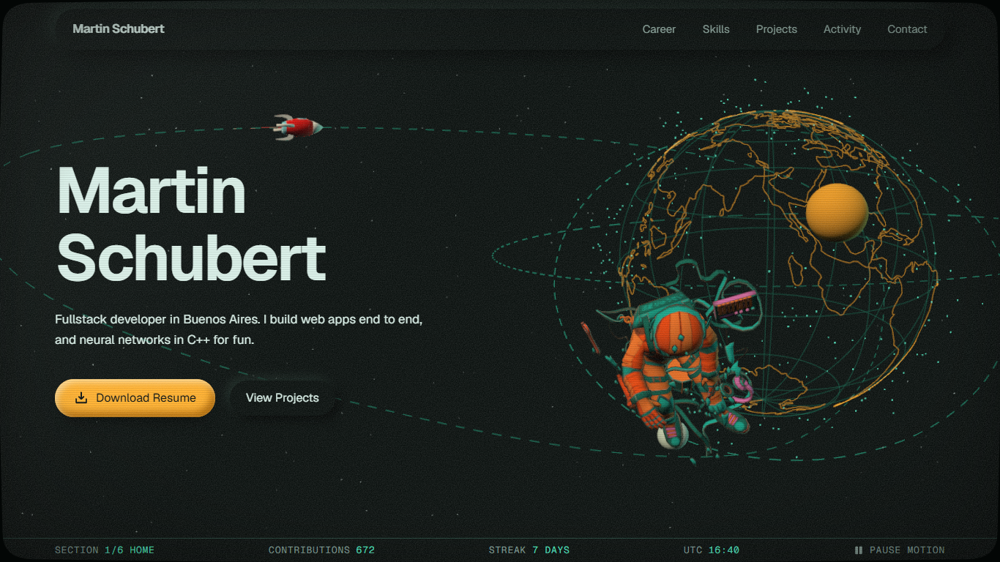
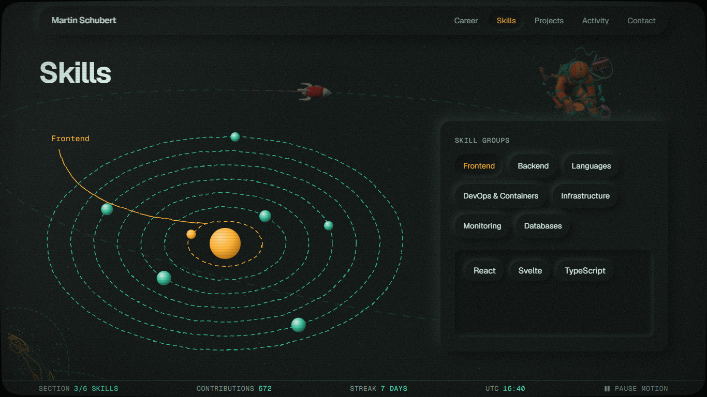
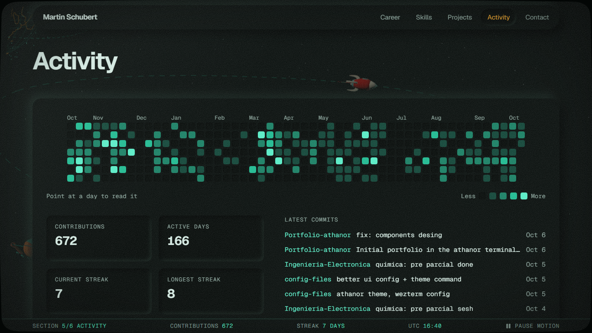
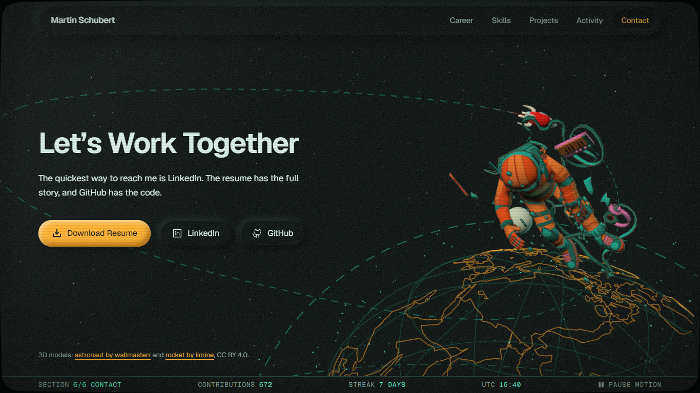

# portfolio-mission-control

Portfolio de Martin Schubert con estética espacial. De fondo, una escena 3D fija: un astronauta
flotando, un cohete que recorre su plan de vuelo y un globo con las costas reales. Adelante, el
contenido armado como una consola de control de misión, todo visto a través de un vidrio de TV de
tubo curvo con scanlines y ruido, con el estilo de
[space-station](https://martinschubert04.github.io/space-station/) como referencia.

Tres estilos, cada uno con un rol: **conceptual sketch** para los diagramas (órbitas, trayectorias,
el globo), **neumorfismo** para lo que se opera o se lee (nav, tabs, botones, lecturas) y
**claymorphism** para los cuerpos (astronauta, cohete, planetas, tarjetas de proyecto, botón principal).









## Qué tiene

- **Escena que acompaña la lectura.** El astronauta y el globo cambian de pose según la sección:
  ocupan la mitad libre en el hero y en contacto, y se atenúan y se corren a un rincón en el medio.
- **Plan de vuelo dibujado.** La curva del cohete está trazada con línea punteada sobre la escena.
- **Skills como sistema solar.** Una órbita por grupo de skills; el grupo elegido se marca en ámbar.
- **Carrera como trayectoria** con waypoints; los vigentes, encendidos.
- **Proyectos en tarjetas de clay**, de a dos por fila con anchos alternados.
- **Actividad de GitHub en una consola**: calendario de LEDs con lectura por día, días activos,
  rachas y los últimos commits.
- **Barra de estado** con sección actual, contribuciones, racha, hora UTC y un botón para pausar el movimiento.

## Correrlo

```powershell
npm install
npm run dev      # http://localhost:5173
```

| Comando | Qué hace |
|---|---|
| `npm run dev` | Servidor de desarrollo |
| `npm run build` | Typecheck y build de producción en `dist/` |
| `npm run preview` | Sirve `dist/` |
| `npm run lint` | ESLint |
| `npm test` | Tests de `src/lib` y de la coreografía de la escena, con Vitest |

## Actualizar contenido

Todo el contenido vive en `src/data/`:

| Archivo | Contenido |
|---|---|
| `site.ts` | Nombre, descripción breve, links, orden de secciones |
| `career.ts` | Experiencia y formación |
| `skills.ts` | Skills agrupadas (una órbita por grupo) |
| `projects.ts` | Proyectos. Mantener la cantidad par: la grilla los muestra de a dos |

El CV descargable es `src/assets/MartinSchubert.pdf`; `career.ts` y `skills.ts` salen de ahí.

Para mover el astronauta o el globo en una sección: `src/scene/choreography.ts`.

## Cómo está armado el repo

Sigue la misma estructura que `portfolio-athanor`, pensada para trabajar con Claude Code y skills de diseño.

| Archivo | Rol |
|---|---|
| [`CLAUDE.md`](CLAUDE.md) | Punto de entrada para el agente: comandos, estructura, flujo de trabajo con skills, desvíos acordados |
| [`DESIGN.md`](DESIGN.md) | Sistema de diseño en formato [awesome-design-md](https://github.com/VoltAgent/awesome-design-md). Fuente de verdad visual |
| [`docs/PLAN.md`](docs/PLAN.md) | Plan por fases: skill que guía cada una, entrega y verificación. Decisiones y alternativas descartadas |
| [`docs/design/reference-analysis.md`](docs/design/reference-analysis.md) | Análisis de las referencias (skill `image-to-code`) |
| [`docs/design/preflight.md`](docs/design/preflight.md) | Auditorías de `design-taste-frontend`, `web-design-guidelines` y `dataviz`, con pendientes |
| [`.claude/skills/`](.claude/skills/README.md) | Skills instaladas, con origen, versión y cómo actualizarlas |

## Deploy

`.github/workflows/deploy.yml` corre lint, tests y build en cada push a `main` y publica `dist/` en la
rama `build`. Falta crear el repo remoto y activar GitHub Pages sobre esa rama. El build usa rutas
relativas, así que funciona bajo cualquier nombre de repo.

## Datos en vivo

| Dato | Fuente | Notas |
|---|---|---|
| Calendario de contribuciones | `github-contributions-api.jogruber.de` | Sin token |
| Últimos commits | API de búsqueda de GitHub | Sin token; 10 pedidos por minuto por IP. Se guarda 30 minutos en `localStorage` |

## Créditos

- Astronauta: [Tenhun Falling spaceman (FanArt)](https://sketchfab.com/3d-models/tenhun-falling-spaceman-fanart-9fd80b6a259f41fd99e6f56eee686dc5)
  de wallmasterr, CC BY 4.0. Se le cambió el material por uno mate y se lo rotó.
- Cohete: [simple rocket](https://sketchfab.com/3d-models/simple-rocket-f73545304c4240489530b643c913f4c8)
  de limine, CC BY 4.0. Se le cambió el material.
- Costas del globo y paleta: [space-station](https://github.com/MartinSchubert04/space-station).
- Fuentes [Geist y Geist Mono](https://vercel.com/font) (OFL).
- Íconos: [Phosphor](https://phosphoricons.com/) (MIT).
- Skills: [taste-skill](https://github.com/leonxlnx/taste-skill) (MIT) y
  [web-design-guidelines](https://github.com/vercel-labs/agent-skills) de Vercel.
