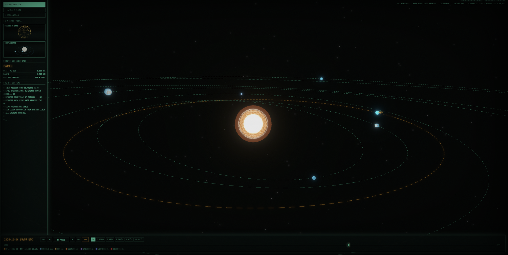
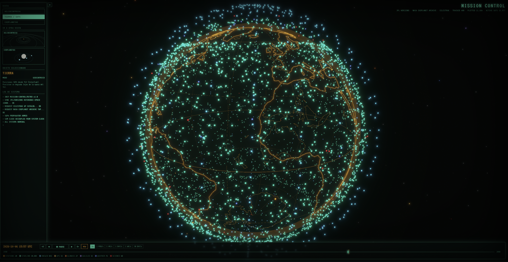

# Análisis de las referencias

Paso de análisis de la skill `image-to-code` (secciones 8, 9 y 21 a 25). La skill pide generar las
imágenes primero; en este entorno no hay generador, así que la fuente de verdad visual son las dos
capturas que dio el usuario (guardadas en `refs/`), el sitio y el repo de
[space-station](https://github.com/MartinSchubert04/space-station), y la escena 3D de la rama
`rework` del portfolio anterior.

Lectura del brief (taste, sección 0.B): *portfolio de desarrollador para reclutadores y otros devs,
con un lenguaje de control de misión retro sobre una escena espacial 3D, hecho con Tailwind v4, CSS
nativo y react-three-fiber, combinando tres estilos pedidos: conceptual sketch, neumorfismo y claymorphism.*

Diales: `DESIGN_VARIANCE 8`, `MOTION_INTENSITY 7`, `VISUAL_DENSITY 4`.

## Referencia 1: vista heliocéntrica

| Qué se ve | Lectura | Dónde quedó |
|---|---|---|
| Sol al centro, órbitas elípticas punteadas en menta, vistas inclinadas | Un diagrama, no una ilustración: línea fina, sin relleno | `OrbitMap`: una órbita por grupo de skills, elipses achatadas al 60% |
| La órbita de la Tierra en ámbar, las demás en menta | El ámbar marca lo seleccionado | La órbita y el cuerpo del grupo elegido pasan a ámbar; es la regla de todo el sitio |
| Panel izquierdo: selector de vista, "objeto seleccionado" con nombre en ámbar y datos | El panel explica lo que se eligió en el diagrama | Consola de skills: lista de grupos (tabs) y panel con las skills del grupo |
| Etiquetas chicas en mayúsculas dentro del panel (`OBJETO SELECCIONADO`, `LOG DE SISTEMA`) | Rótulo de instrumento | Clase `.label`, solo dentro de consolas y en la barra de estado |
| Log de sistema con líneas `> ...` | Texto mono como registro | Lista "Latest Commits": repo, mensaje y fecha, sin divisores |
| Barra inferior: fecha y hora UTC en ámbar, controles, leyenda | Franja de estado con datos reales | `StatusBar`: sección, contribuciones, racha, UTC y el botón Pause Motion |
| Planetas como discos chicos de color plano | Cuerpos sobre líneas | Cuerpos de clay (gradiente radial con luz arriba a la izquierda) |

## Referencia 2: Tierra y satélites

| Qué se ve | Lectura | Dónde quedó |
|---|---|---|
| Globo transparente: grilla de meridianos y paralelos muy tenue, costas reales en ámbar | El planeta dibujado, no texturado | `scene/Globe.tsx`: misma grilla y el mismo `continents.json` del proyecto de referencia |
| Nube de puntos menta alrededor del globo | Capa de satélites | 280 puntos en capas sobre la superficie, girando más rápido que el globo |
| El globo ocupa casi todo el alto | Un objeto protagonista por pantalla | Hero: globo a escala 1.5 a la derecha. Contacto: vuelve a escala 3.2 como horizonte |
| Fondo casi negro verdoso con estrellas tenues | Profundidad sin ruido | `Starfield` de 900 puntos; fondo `hull` |
| Título `MISSION CONTROL` con glow, scanlines y viñeta CRT | Capa retro del proyecto | `CrtOverlay`: scanlines, ruido, viñeta, bisel curvo y deformación de tubo sobre la escena. Sin glow ni flicker |

## Rama `rework` del portfolio anterior

| Qué hay | Qué se hizo |
|---|---|
| `SpaceScene`: canvas fijo, estrellas, planeta con continentes inventados, dos lunas, cohete en una curva cerrada, astronauta a la izquierda | Se conserva la idea y la disposición por capas de profundidad. Se reescribió para que la escena cambie de pose por sección |
| Continentes generados con armónicos al azar | Reemplazados por las costas reales de space-station |
| `drei/Line` (una malla por línea, 100+ objetos) | `LineSegments` con una sola geometría por capa |
| Cohete con período de 130 s, "para que no se note el loop" | 75 s y la curva dibujada punteada: el loop pasa a ser un plan de vuelo a la vista |
| Astronauta en la pose de caída del clip (cabeza abajo) | Rotado 148° para que se lea flotando |
| Bloom de postprocesado, tema "station" con filtro CRT | Sin postprocesado: dos dependencias menos y la superficie de clay se ve mate |
| `spaceman.glb`, `simple_rocket.glb` | Se reutilizan. Son CC BY 4.0 (wallmasterr y limine en Sketchfab); el crédito va en Contact |

## Sistema extraído

**Color.** Negro verdoso, menta de fósforo para líneas y lecturas, ámbar para lo seleccionado. Los
hex salen de `src/index.css` de space-station. La menta se suavizó (`#22FFC4` a `#5CF2CB`) y el fondo
se aclaró apenas (`#020403` a `#0B110F`) porque el neumorfismo necesita poder oscurecer y aclarar
alrededor del fondo.

**Tipografía.** La referencia usa VT323 para títulos y Share Tech Mono para el resto. No se trajeron.
La primera versión usó Unbounded, Share Tech Mono y una manuscrita (Architects Daughter) para las
notas de los sketches, y el usuario las descartó, sobre todo la manuscrita de las fechas de carrera.
Quedó una sola familia en dos cortes: Geist para leer y Geist Mono para lecturas, fechas y rótulos.
El aire de consola lo da la mono en los datos, no una fuente de época.

**Los tres estilos pedidos.** En vez de mezclarlos por componente, cada uno tiene un rol:

| Estilo | Rol | Ejemplos |
|---|---|---|
| Conceptual sketch | Lo que es un diagrama | Órbitas, plan de vuelo del cohete, globo, trayectoria de carrera, notas en mono |
| Neumorfismo | Lo que se opera o se lee | Nav, tabs, botones, paneles, lecturas, calendario de LEDs |
| Claymorphism | Lo que es un cuerpo | Astronauta, cohete, lunas, planetas, tarjetas de proyecto, botón principal |

El neumorfismo y la consola de la referencia son la misma idea (un tablero físico), y el clay
resuelve cómo iluminar los modelos 3D: mate, sin brillo especular, luz cálida desde arriba a la izquierda.

## Lo que se dejó afuera

- **Flicker, barras de glitch y glow del CRT.** La primera versión dejó afuera toda la capa CRT; el
  usuario pidió después un efecto de TV de tubo curvo con ruido, y se sumó (`CrtOverlay`, con la
  receta de deformación del overlay de la rama `rework`). Lo que sigue afuera es lo que parpadea:
  el flicker y los glitches son un problema de accesibilidad, y el glow baja la nitidez del texto.
- **Controles de tiempo.** En la referencia mueven una simulación. Acá no hay nada que simular; el
  único control que tiene sentido es pausar el movimiento, y está.

## Lo que las referencias no definían

Resuelto según el orden de la sección 28 de `image-to-code` (preservar lenguaje, layout, familia de
componentes, y recién después inventar):

- **Carrera.** No hay nada parecido a una línea de tiempo en las capturas. Se usó el lenguaje de las
  órbitas: una trayectoria punteada con waypoints, y el waypoint encendido en ámbar si sigue vigente.
- **Proyectos.** Las capturas de proyecto necesitan una superficie opaca para leerse sobre la escena:
  tarjetas de clay oscuro.
- **Contribuciones.** Un calendario de LEDs sobre la consola, con una sola rampa de menta.
- **Mobile.** Las referencias son de escritorio. En vertical la escena tiene poses propias, más
  chicas y en la mitad de abajo, para quedar debajo del texto y no detrás.
